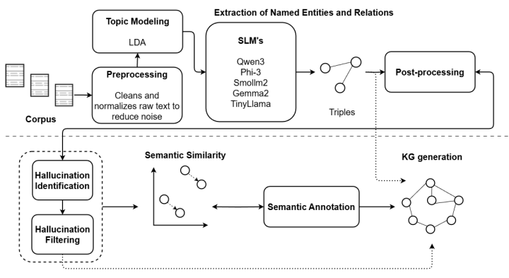

<div align="center">
    <h1>knowledge graph construction SLMs</h1>
</div>

This repository shows a semi-automatic framework for generating Knowledge Graphs about earthquakes from unstructured text using Small Language Models. Through techniques to reduce hallucinations and improve semantic coherence, the approach achieves reliable and verifiable graphs, demonstrating that SLMs can extract quality knowledge in critical domains.

<h2 style="font-size: 2rem; margin-bottom: 20px;">Characteristics</h2>

The proposal is divided into nine sections: 

1) Corpus Selection & Pre-Processing
2) Extraction of Named Entities and Relations
3) Post-processing
4) Hallucination Filtering
5) Semantic Similarity
6) Semantic Annotation and KG Generation
7) Experiment

As shown in the following image

<div align="center">
    
</div>

<h2 style="font-size: 2rem; margin-bottom: 20px;">Metrics</h2>

The metrics used were the following:

1. Number of nodes and edges
2. Percentage of overlap and differences
3. Frequency of specific types of entities
4. Clustering coefficient
5. Density
6. Average degree
7. Percentage of hallucination
8. Redundancy
9. Contextual relevance

<h2 style="font-size: 2rem; margin-bottom: 20px;">Small Language Models</h2>

Example of how few shots were implemented in SLM. The SLMs were obtained using Ollama (https://ollama.com/search).

```python
def load_examples(filename):
    """Carga los ejemplos desde un archivo JSON"""
    try:
        with open(filename, 'r', encoding='utf-8') as f:
            return json.load(f)
    except FileNotFoundError:
        raise FileNotFoundError(f"No se encontró el archivo de ejemplos: {filename}")

def format_examples(examples):
    """Formatea los ejemplos para el prompt"""
    formatted_examples = ""
    for example in examples:
        formatted_examples += f"\nTexto de entrada: {example['input']}\nSalida JSON:\n{json.dumps(example['output'], indent=2, ensure_ascii=False)}\n"
    return formatted_examples

def process_text(text, examples):
    formatted_examples = format_examples(examples)
    
    prompt = f"""Eres un experto en extracción de relaciones semánticas con formato estructurado JSON.
    Aquí tienes algunos ejemplos de cómo extraer entidades y relaciones en formato JSON: {formatted_examples}
    Siguiendo EXACTAMENTE el mismo formato de {formatted_examples}, analiza el siguiente texto y genera ÚNICAMENTE un array JSON. NO incluyas explicaciones ni texto adicional:{text}
    
    IMPORTANTE:
    - La salida debe ser únicamente un array JSON parseable
    - Cada objeto del array debe tener exactamente estas claves: "head", "head_type", "relation", "tail", "tail_type"
    - No incluyas comentarios ni texto adicional
    """

    response = ollama.chat(model='smollm2', messages=[{'role': 'user', 'content': prompt}]) #llama2model olmo2model gemma3model deepmodel llama4model phi3 smollm2 qwen3:4b orca-mini
    return response['message']['content']

def process_df_chunk(chunk, text_column, output_column, examples):
    results = []
    total_rows = len(chunk)
    
    for index, row in chunk.iterrows():
        try:
            text = row[text_column]
            result = process_text(text, examples)
            results.append(result)
            
            # Liberar memoria
            del text
            del result
            gc.collect()
            
            print(f"Procesado {index + 1}/{total_rows} ({((index + 1)/total_rows)*100:.2f}%)")
            
        except Exception as e:
            print(f"Error en fila {index}: {str(e)}")
            results.append(None)
    
    chunk[output_column] = results
    return chunk

# Cargar ejemplos desde archivo JSON
examples = load_examples('ejemplos_desastres.json')

# Procesar el DataFrame en chunks
text_column = 'texto_completo'
output_column = 'TripletasLlama'
chunksize = 100  # Tamaño del chunk

filename = 'C:/Users/....csv'
output_filename = 'C:/Users/L.....csv'

chunk_list = []

for chunk in pd.read_csv(filename, encoding="latin8", chunksize=chunksize):
    processed_chunk = process_df_chunk(chunk, text_column, output_column, examples)
    chunk_list.append(processed_chunk)

df_tripletas = pd.concat(chunk_list)

# Guardar resultados
df_tripletas.to_csv(output_filename, index=False)
print(f"Archivo procesado y guardado en {output_filename}")
```

